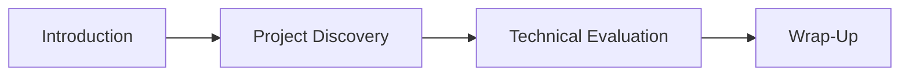
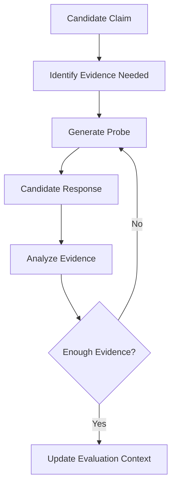
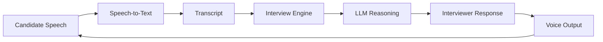
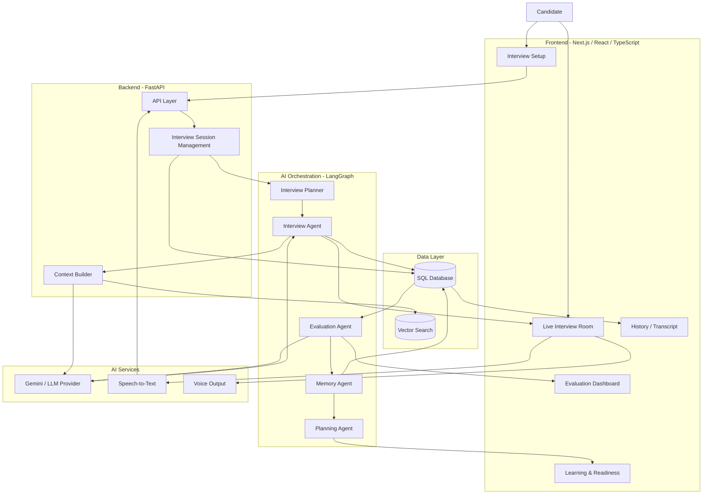
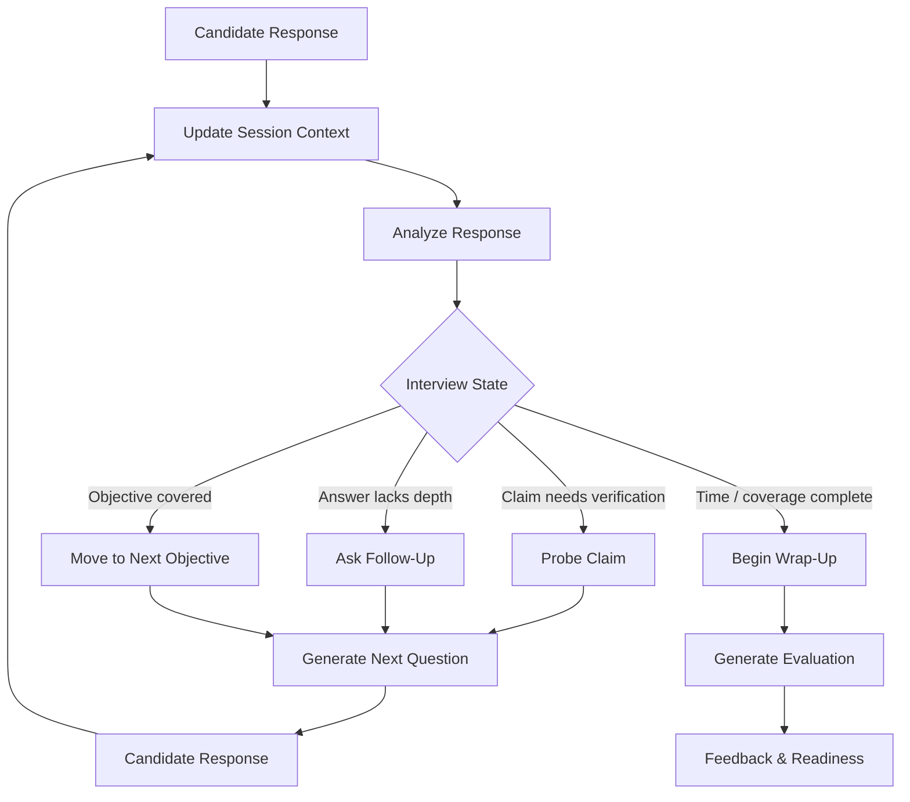
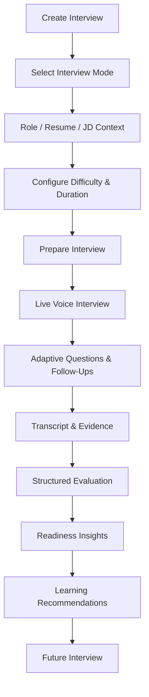

# Veriq

<p align="center">
  <strong>AI Interview Intelligence Platform</strong>
</p>

<p align="center">
  Adaptive, voice-first interviews with context-aware questioning, structured evaluation, and personalized improvement.
</p>

<p align="center">
  <a href="https://veriq-flax.vercel.app"><strong>🌐 Live Demo</strong></a>
  &nbsp;&nbsp;•&nbsp;&nbsp;
  <a href="https://github.com/Hitesh564/Veriq"><strong>💻 Source Code</strong></a>
</p>

---

## Overview

**Veriq** is an AI-powered interview preparation platform designed to simulate realistic, adaptive interviews rather than simply asking candidates a fixed list of questions.

The system dynamically adjusts the interview based on:

- target role,
- resume,
- job description,
- difficulty,
- interview duration,
- company style,
- previous candidate responses,
- and interview progress.

Veriq combines **LLM orchestration, voice interaction, transcript intelligence, persistent interview state, structured evaluation, and personalized learning recommendations** into an end-to-end interview experience.

Instead of treating every question independently, Veriq maintains context across the session and uses previous responses to determine **what should be asked next and how deeply a topic should be explored**.

---

# Product Preview

<!--
CREATE THIS FOLDER IN THE ROOT OF THE REPOSITORY:

assets/
├── landing-page.png
├── interview-setup.png
├── live-interview.png
├── evaluation-dashboard.png
└── transcript-history.png

Take clean screenshots from the deployed product and save them with these exact names.
-->

## Landing Page

<!-- ADD SCREENSHOT 1 HERE -->
<!-- File: assets/landing-page.png -->


---

## Interview Configuration

Candidates can configure interviews around their target role, resume, job description, difficulty, duration, and preferred interview style.

<!-- ADD SCREENSHOT 2 HERE -->
<!-- File: assets/interview-setup.png -->


---

## Live AI Interview

The interview room conducts a real-time, voice-first conversation while maintaining context across candidate responses.

<!-- ADD SCREENSHOT 3 HERE -->
<!-- File: assets/live-interview.png -->


---

## Evaluation & Insights

After an interview, Veriq converts the session into structured feedback containing strengths, weaknesses, readiness signals, and areas that require improvement.

<!-- ADD SCREENSHOT 4 HERE -->
<!-- File: assets/evaluation-dashboard.png -->


---

## Transcript & History

Interview transcripts and previous sessions remain available for review and future progress tracking.

<!-- ADD SCREENSHOT 5 HERE -->
<!-- File: assets/transcript-history.png -->


---

# Why Veriq?

Many interview preparation systems follow a simple workflow:

```text
Question
   ↓
Answer
   ↓
Score
   ↓
End
```

This creates several problems:

- questions often remain static,
- follow-ups are generic,
- candidate claims are rarely explored,
- previous answers have little influence on future questions,
- evaluations can become shallow LLM-generated scores,
- and each interview exists in isolation.

Veriq instead follows a continuous interview intelligence loop:

```text
Interview
    ↓
Context-Aware Questioning
    ↓
Evidence Collection
    ↓
Structured Evaluation
    ↓
Readiness Analysis
    ↓
Learning Recommendations
    ↓
Re-Interview
    ↓
Improvement
```

The goal is not simply to ask more questions.

The goal is to understand:

> **What does the candidate actually know, how deeply do they understand it, and what should the interviewer ask next to verify that?**

---

# Core Capabilities

## 1. Adaptive Interview Engine

Veriq does not rely on a static question bank.

The interview engine dynamically determines whether it should:

- ask a new question,
- deepen into the current topic,
- challenge an incomplete response,
- verify a technical claim,
- ask for implementation details,
- explore trade-offs,
- move to another interview objective,
- or begin wrapping up the session.

A simplified decision process looks like:

```text
Candidate Answer
      ↓
Update Interview Context
      ↓
Analyze Answer
      ↓
Determine Coverage / Evidence
      ↓
Choose Next Interview Action
      ↓
Generate Contextual Question
```

This allows the conversation to behave more like an actual interview instead of a sequence of unrelated prompts.

---

## 2. Multiple Interview Modes

Veriq supports different ways of constructing interview context.

| Mode | Description |
|---|---|
| **Role-Based** | Generates an interview around a selected target role |
| **Resume-Based** | Explores candidate experience, skills, and projects |
| **JD-Based** | Aligns questions with a specific job description |
| **Resume + JD** | Combines candidate experience with role requirements |
| **Company Style** | Adjusts interview behavior toward a selected company style |

Candidates can additionally control:

- difficulty,
- interview duration,
- target role,
- and contextual documents.

---

# Multi-Stage Interview Orchestration

Rather than treating an interview as one large conversation, Veriq structures the session into logical stages.



Each stage has different objectives.

### Introduction

Establishes context and begins the interview naturally.

### Project Discovery

Explores candidate experience, resume projects, technical ownership, and implementation details.

### Technical Evaluation

Probes technical depth, architecture decisions, debugging ability, scalability, and trade-offs.

### Wrap-Up

Concludes the session and prepares the collected conversation for evaluation.

---

# Interview Blueprint

Before and during the interview, the system maintains a structured understanding of what needs to be explored.

Conceptually:

```text
Target Role / Resume / JD
          ↓
Interview Context
          ↓
Topic / Objective Planning
          ↓
Coverage Tracking
          ↓
Adaptive Question Selection
```

This prevents the LLM from simply generating random technically relevant questions.

Instead, the interview operates around **objectives and coverage**.

The system can reason about:

- what has already been discussed,
- which objectives have enough evidence,
- which topics require deeper probing,
- and which areas have not yet been covered.

---

# Context-Aware Follow-Ups

One of the central design goals of Veriq is to avoid generic follow-up questions.

A basic AI interviewer might respond to an answer with:

> "Can you explain that in more detail?"

Veriq attempts to generate follow-ups based on the actual claims and reasoning present in the conversation.

For example:

```text
Candidate:
"I reduced the inference latency of our model by around 40%."

        ↓

Interviewer:
"What was causing most of the latency before the optimization?"

        ↓

Candidate:
"The model inference stage was the main bottleneck."

        ↓

Interviewer:
"What changes did you make to the inference pipeline,
and how did you measure the 40% improvement?"
```

The interaction moves from:

```text
Answer → Generic Follow-Up
```

toward:

```text
Answer
   ↓
Extract Important Claim
   ↓
Identify Missing Evidence
   ↓
Generate Targeted Probe
```

---

# Claim Verification & Evidence Collection

Candidates frequently make claims during interviews:

```text
"I designed the backend architecture."

"I improved model accuracy."

"I optimized the API."

"I implemented the deployment pipeline."
```

A strong interviewer should not automatically accept those statements.

Veriq includes an LLM-based reasoning layer that can explore such claims through multiple conversational turns.



This helps the interview distinguish between:

- familiarity with terminology,
- actual implementation experience,
- technical ownership,
- debugging ability,
- architectural reasoning,
- and understanding of design trade-offs.

---

# Evidence-Grounded Evaluation

Veriq's evaluation system is designed to go beyond asking an LLM:

```text
"Rate this candidate from 1 to 10."
```

Instead, the system evaluates performance using the context and evidence accumulated during the interview.

Evaluation can cover dimensions such as:

| Dimension | What It Evaluates |
|---|---|
| **Architecture** | Ability to structure and reason about systems |
| **Implementation** | Understanding of how a solution was actually built |
| **Debugging** | Ability to identify, reason about, and solve failures |
| **Trade-offs** | Awareness of alternatives and engineering decisions |
| **Scalability** | Understanding of system growth and performance |
| **Communication** | Ability to clearly explain technical reasoning |

The resulting evaluation can then be converted into:

- performance scores,
- strengths,
- weaknesses,
- readiness indicators,
- and recommended areas for improvement.

---

# Voice-First Interview Experience

Veriq supports spoken interview sessions to make the experience closer to an actual interview.

The general voice pipeline is:



The voice layer interacts with the same interview state used by the orchestration engine.

This enables:

- voice-based candidate responses,
- live transcript capture,
- conversational turn progression,
- context preservation,
- and low-latency interview interaction.

---

# System Architecture

Veriq follows a split frontend/backend architecture with a dedicated agent orchestration layer.



---

# Interview Decision Flow

At every conversational turn, the system needs to determine the most useful next action.

A simplified version:



---

# Agent Architecture

Veriq separates major responsibilities into specialized agents rather than placing the complete workflow inside one large prompt.

## Interview Planner

The Interview Planner prepares the structure that guides the session.

Responsibilities include:

- determining interview focus,
- creating interview objectives,
- organizing topic coverage,
- incorporating role/resume/JD context,
- and helping control interview progression.

---

## Interview Agent

The Interview Agent controls the active conversation.

Responsibilities include:

- generating questions,
- adapting question depth,
- managing interview progression,
- generating contextual follow-ups,
- probing candidate claims,
- maintaining continuity,
- and moving between interview stages.

---

## Evaluation Agent

The Evaluation Agent analyzes the completed session.

Responsibilities include:

- evaluating candidate responses,
- interpreting collected evidence,
- identifying strengths and weaknesses,
- evaluating technical competencies,
- and generating structured performance insights.

---

## Memory Agent

The Memory Agent maintains information that should persist beyond one conversational turn or interview session.

This allows Veriq to maintain a longer-term understanding of candidate performance rather than treating every interaction independently.

---

## Planning Agent

The Planning Agent converts evaluation results into future recommendations.

It helps transform:

```text
Interview Result
       ↓
Weak Areas
       ↓
Recommended Learning
       ↓
Future Practice Focus
```

---

# End-to-End Interview Pipeline

The complete interview lifecycle can be summarized as:

```text
1. Candidate creates an interview
              ↓
2. Role / Resume / JD context is provided
              ↓
3. Interview objectives are prepared
              ↓
4. Live interview begins
              ↓
5. Candidate responds
              ↓
6. Speech is converted into transcript
              ↓
7. Interview context is updated
              ↓
8. Current answer is analyzed
              ↓
9. System determines the next interview action
              ↓
10. Follow-up / probe / new question is generated
              ↓
11. Coverage and evidence accumulate across turns
              ↓
12. Interview reaches wrap-up
              ↓
13. Evaluation agent processes the session
              ↓
14. Strengths, weaknesses and readiness are generated
              ↓
15. Evaluation feeds future learning and practice
```

---

# Persistent Interview State

A realistic interview requires more than conversation history.

The system needs structured information about the interview itself.

Examples include:

```text
Current Interview Stage

Topics Already Covered

Current Objective

Previous Candidate Claims

Evidence Collected

Remaining Objectives

Conversation Context

Candidate Profile

Interview Configuration
```

Maintaining this information allows Veriq to keep the conversation coherent across multiple turns.

---

# Context Management

Passing every piece of historical information to the LLM on every turn is inefficient and can reduce the quality of reasoning.

Veriq therefore separates:

```text
Raw Conversation
       +
Structured Interview State
       +
Relevant Context
       ↓
Next Interview Decision
```

The system attempts to preserve the information required for the next decision while keeping the prompt focused on the current interview objective.

---

# Product Flow



---

# Product Experience

## Interview Setup

Users can configure a session through:

- target role,
- difficulty,
- duration,
- resume,
- job description,
- resume + JD mode,
- and company style.

---

## Live Interview Room

The live interview room supports:

- adaptive question generation,
- follow-up questions,
- voice responses,
- transcript capture,
- multi-turn context,
- and realistic conversational progression.

---

## Interview Results

After the interview, the system can surface:

- transcript history,
- evaluation scores,
- strengths,
- weaknesses,
- readiness indicators,
- and recommended next steps.

---

## Learning Loop

Veriq extends beyond a single interview.

Previous interview results can contribute to:

- future practice recommendations,
- candidate readiness understanding,
- learning resources,
- and targeted re-interviewing.

---

# Engineering Challenges

Building Veriq involves several problems beyond simply connecting an LLM API.

## 1. Stateful Multi-Turn Interviewing

Questions cannot be generated independently.

The interviewer needs to understand:

```text
What has already been asked?

What did the candidate claim?

What evidence has been collected?

Which objectives are complete?

Which areas still require exploration?

What is the most useful next question?
```

This requires explicit interview state rather than relying only on raw chat history.

---

## 2. Avoiding Generic Follow-Ups

Without additional control, an LLM interviewer frequently generates repetitive questions.

Veriq combines structured state and conversation context so follow-ups can target specific gaps in the candidate's explanation.

---

## 3. Evidence-Based Evaluation

LLMs can easily produce confident but weakly grounded scores.

Veriq's evaluation architecture instead attempts to connect candidate evaluation to information collected during the interview.

---

## 4. Voice Latency

Voice interaction introduces multiple latency components:

```text
Speech
  ↓
Speech-to-Text
  ↓
Backend Processing
  ↓
LLM Generation
  ↓
Voice Response
  ↓
Playback
```

Maintaining natural conversational pacing therefore requires reducing unnecessary work throughout the pipeline.

---

## 5. Context Management

Long interviews can produce large amounts of conversational data.

The system needs to preserve useful context without making every model request depend on the complete raw transcript.

---

## 6. Interview Coverage

An adaptive interviewer must balance two competing objectives:

```text
Explore Interesting Candidate Responses
                vs
Cover Required Interview Topics
```

The interview engine therefore needs to manage both dynamic follow-ups and structured coverage.

---

# Technology Stack

## Frontend

- **Next.js 16**
- **React 19**
- **TypeScript**
- App Router
- Supabase browser client integration
- Voice integration
- Custom responsive UI

---

## Backend

- **Python**
- **FastAPI**
- **LangGraph**
- **SQLModel**
- REST APIs
- Interview and transcript services
- Evaluation services
- Authentication integration

---

## AI & LLM Layer

- **Gemini API**
- LLM-based interview agents
- Context-aware prompting
- Structured evaluation
- Multi-agent orchestration
- Retrieval / vector-search support

---

## Voice

The repository supports voice and speech-processing integrations including:

- Speech-to-text services
- Whisper-compatible speech processing
- Deepgram configuration where enabled
- Voice interaction layer
- Transcript processing

---

## Data

- **PostgreSQL / SQL database configuration**
- **Supabase**
- SQLModel / SQLAlchemy-style persistence
- Qdrant vector-search support
- SQLite support for local development

---

## Infrastructure & Deployment

- **Vercel** — frontend deployment
- Cloud-hosted FastAPI backend
- Managed authentication/database services
- Environment-based configuration

---

# Repository Structure

```text
Veriq/
│
├── backend/
│   └── app/
│       │
│       ├── agents/
│       │   ├── interview_agent.py
│       │   ├── interview_planner.py
│       │   ├── evaluation_agent.py
│       │   ├── memory_agent.py
│       │   ├── planning_agent.py
│       │   ├── profiles.py
│       │   └── state.py
│       │
│       ├── models/
│       ├── routers/
│       ├── services/
│       ├── payments/
│       ├── subscriptions/
│       ├── scripts/
│       │
│       ├── config.py
│       ├── database.py
│       └── main.py
│
├── frontend/
│   ├── app/
│   │   ├── components/
│   │   ├── interview/
│   │   ├── new-interview/
│   │   ├── history/
│   │   ├── learning/
│   │   ├── profile/
│   │   ├── billing/
│   │   └── ...
│   │
│   └── ...
│
├── requirements.txt
├── .env.example
├── LICENSE
└── README.md
```

---

# API Responsibilities

The FastAPI backend provides services related to:

- authentication,
- interview creation,
- session preparation,
- interview orchestration,
- candidate context,
- transcript processing,
- evaluation generation,
- profile management,
- readiness tracking,
- learning-plan generation,
- voice-session support,
- payments,
- and subscription workflows.

A health endpoint is also available for deployment verification.

```text
GET /api/health
```

---

# Running Veriq Locally

## Prerequisites

Make sure the following are installed:

- Python 3.10+
- Node.js 20+
- npm
- Git

---

## 1. Clone the Repository

```bash
git clone https://github.com/Hitesh564/Veriq.git
cd Veriq
```

---

## 2. Install Backend Dependencies

From the project root:

```bash
pip install -r requirements.txt
```

Move into the backend directory:

```bash
cd backend
```

Start FastAPI:

```bash
uvicorn app.main:app --reload --host 0.0.0.0 --port 8000
```

The backend should now be available at:

```text
http://localhost:8000
```

Health check:

```text
http://localhost:8000/api/health
```

---

## 3. Install Frontend Dependencies

Open another terminal:

```bash
cd frontend
npm install
```

Start the development server:

```bash
npm run dev
```

The frontend should now be available at:

```text
http://localhost:3000
```

---

# Environment Variables

Create the required environment files before running the application.

## Backend

Example configuration:

```env
DATABASE_URL=sqlite:///./dev.db

GEMINI_API_KEY=your_gemini_api_key

DEEPGRAM_API_KEY=your_deepgram_api_key
WHISPER_API_KEY=your_whisper_api_key
GROQ_API_KEY=your_groq_api_key

NVIDIA_API_KEY=your_nvidia_api_key

SUPABASE_URL=your_supabase_url
SUPABASE_ANON_KEY=your_supabase_anon_key
```

The exact services required depend on which integrations are enabled.

For local development, the database can default to SQLite.

---

## Frontend

Create:

```text
frontend/.env.local
```

Example:

```env
NEXT_PUBLIC_SUPABASE_URL=your_supabase_url
NEXT_PUBLIC_SUPABASE_ANON_KEY=your_supabase_anon_key
```

> **Never commit production credentials or private API keys to the repository.**

---

# Optional Demo GIF

<!--
THIS IS OPTIONAL, BUT HIGHLY RECOMMENDED.

Once the screenshots are added, you can record a 15–30 second GIF showing:

1. New Interview
2. Select role/resume/JD
3. Enter interview room
4. AI asks question
5. User responds
6. AI asks contextual follow-up
7. Evaluation dashboard

Save as:

assets/veriq-demo.gif

Then UNCOMMENT the following section.
-->

<!--

## Demo

<p align="center">
  
</p>

-->

---

# Additional Product Areas

Beyond the core interview engine, the application also includes product functionality around:

- interview history,
- transcript review,
- candidate profiles,
- learning recommendations,
- readiness insights,
- application settings,
- billing,
- and subscription management.

These features turn Veriq from an isolated AI demo into a complete interview-practice product.

---

# Future Development

Potential directions for future development include:

- deeper technical interview specialization,
- richer evidence-grounded evaluation,
- improved interview objective planning,
- enhanced long-term readiness tracking,
- more advanced voice interaction,
- richer candidate analytics,
- improved latency optimization,
- expanded interview modes,
- and more advanced technical-interview workflows.

---

# Design Philosophy

Veriq is built around a simple idea:

> **A useful AI interviewer should not merely generate questions — it should understand the conversation well enough to know what should be asked next.**

That requires combining:

```text
LLM Reasoning
      +
Structured Interview State
      +
Candidate Context
      +
Evidence Collection
      +
Adaptive Questioning
      +
Evaluation
```

The result is an interview experience that aims to be more contextual, structured, and useful than a generic conversational mock interview.

---

# Motivation

Interview quality depends on much more than whether a candidate eventually reaches the correct answer.

A strong interviewer should be able to understand:

- how the candidate approaches a problem,
- whether they actually understand what they built,
- whether technical claims can be supported,
- whether they understand architectural decisions,
- how they debug,
- whether they recognize trade-offs,
- and how clearly they communicate their reasoning.

Veriq explores how **LLMs, agent orchestration, persistent state, voice interaction, and evidence-based evaluation** can work together to model that process.

---

# Contributing

Veriq is currently under active development.

If you encounter an issue or have an idea for improvement, feel free to open an issue or submit a pull request.

---

# License

This project is licensed under the **MIT License**.

See the [LICENSE](LICENSE) file for more information.

---

<p align="center">
  <strong>Veriq — Adaptive interviews. Evidence-grounded evaluation. Continuous improvement.</strong>
</p>

<p align="center">
  <a href="https://veriq-flax.vercel.app">Live Demo</a>
  •
  <a href="https://github.com/Hitesh564/Veriq">GitHub</a>
</p>
