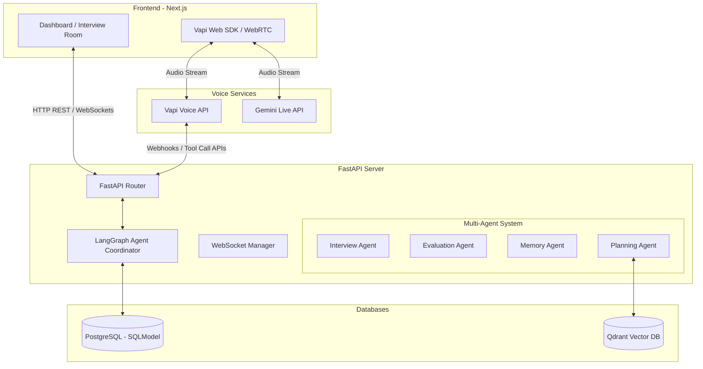
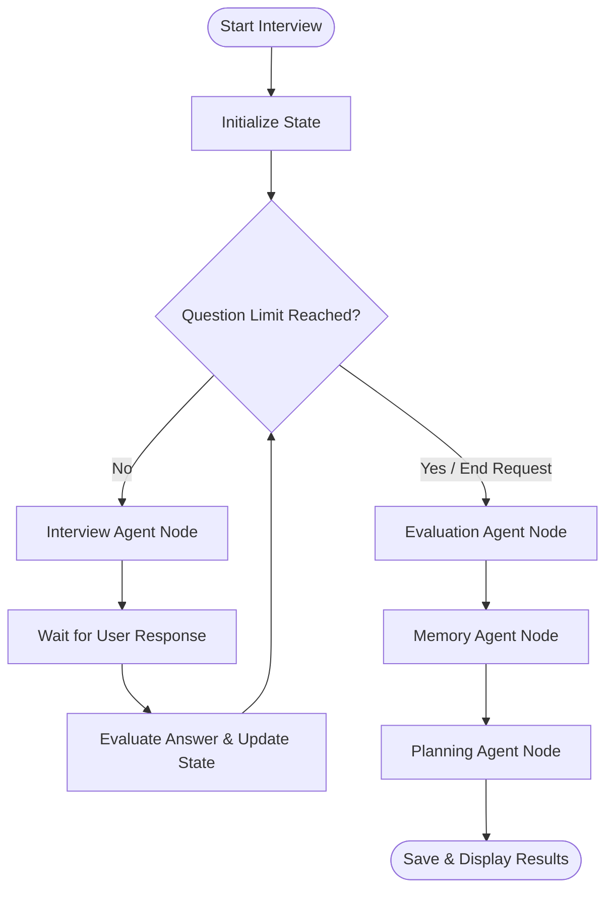

# Veriq AI - System Architecture

This document outlines the architecture, data flows, and multi-agent coordination system of the Veriq AI platform.

---

## 1. High-Level Component Architecture

Veriq AI is a split-stack application consisting of a modern frontend web application, an asynchronous agent-driven backend, a state database, a vector search database, and third-party voice streaming integration.



### Component Details
1. **Frontend (Next.js)**: Build using React, utilizing Vanilla CSS for custom premium styles (glassmorphism, dark-mode styling, and smooth transitions). 
   - Handles text-based chat interface.
   - Embeds WebRTC-based SDKs for direct audio connectivity with Vapi or Gemini Live.
   - Renders interactive dashboards showing readiness score trends, category-wise score radar/bar charts, and personalized study roadmaps.
2. **Backend (FastAPI)**: Asynchronous Python backend designed to handle fast response times, REST requests, and real-time WebSocket communication.
   - Provides user authentication and session management.
   - Exposes WebSocket endpoints for real-time text interview streaming.
   - Exposes webhook endpoints for Vapi/Gemini Live to send transcribed conversations or receive dynamically generated agent responses.
3. **Agent Coordinator (LangGraph)**: Manages stateful agent transitions. Operates on a defined execution graph where nodes represent specific agent prompts/actions and edges represent flow logic (e.g., branching to evaluation when the time expires).
4. **Databases**:
   - **PostgreSQL**: Stores relational transactional data (users, interview sessions, full transcript records, evaluation metrics, and study plans).
   - **Qdrant Vector DB**: Powers the Global Knowledge Base. Stores split semantic chunks of DSA roadmaps, ML concepts, system design guidelines, and behavioral frameworks along with their embeddings.

---

## 2. LangGraph Agent Coordination Flow

The core intelligence of the platform resides in a stateful multi-agent system built using LangGraph. The four specialized agents operate sequentially or conditionally as defined below:



### LangGraph State Schema
The graph maintains the following context (State) across the session:
```python
class InterviewState(TypedDict):
    interview_id: str
    user_id: str
    role: str
    difficulty_level: str  # "easy" | "medium" | "hard"
    current_question: str
    question_count: int
    max_questions: int
    covered_topics: List[str]
    missing_topics: List[str]
    transcript: List[Dict[str, str]]  # [{"role": "interviewer"/"candidate", "text": "...", "timestamp": "..."}]
    eval_report: Dict[str, Any]
    user_profile: Dict[str, Any]
    study_plan: Dict[str, Any]
```

### Agent Nodes and Responsibilities

1. **Interview Agent**:
   - **Trigger**: Every turn during the active interview.
   - **Logic**: Evaluates the user's last response. Determines whether to ask a follow-up question (drilling down on a specific topic, e.g., "Why FAISS instead of Qdrant?") or transition to a new topic from `missing_topics`.
   - **Difficulty Adapter**: Dynamically adjusts question complexity. If the candidate answers poorly twice, the agent adjusts difficulty downward. If they answer exceptionally well, difficulty steps up.
   - **Output**: Appends the next question to the transcript and updates state fields.

2. **Evaluation Agent**:
   - **Trigger**: When the interview time/question limit is reached or the user ends the interview.
   - **Logic**: Performs bulk analysis on the full transcript. Evaluates the candidate against six parameters: Technical Knowledge, Communication, Confidence, Project Explanation, Problem Solving, and Behavioral Performance.
   - **Output**: Generates numerical scores (0-100) for each category, lists strengths/weaknesses, and highlights key improvement areas.

3. **Memory Agent**:
   - **Trigger**: Right after evaluation completes.
   - **Logic**: Reads the candidate's historical performance records from PostgreSQL. Merges current evaluation findings to update the user's running Profile.
   - **Readiness Calculator**: Computes a dynamic readiness percentage (e.g., "Google SWE Readiness: 68%") by weighting current topic performance against standard company requirements.
   - **Output**: Updates `user_profiles` and computes current readiness metrics.

4. **Planning Agent**:
   - **Trigger**: After the memory agent updates the profile.
   - **Logic**: Identifies topics marked as "weak". Formulates semantic queries to search the Qdrant database for articles, practice problems, and study resources.
   - **Output**: Compiles a customized learning plan containing study milestones, curated resources, and practice questions. Also configures parameters for a future 15-minute targeted "Re-Interview".

---

## 3. WebSockets & Voice streaming Flows

Real-time interaction requires low-latency pipelines. The platform supports both text-only WebSocket communication and real-time voice streaming.

### Text-Based WebSocket Connection Flow
1. Client establishes WebSocket connection: `ws://api.veriq.ai/ws/interview/{session_id}`.
2. Server loads the current interview session and sends the first question.
3. User types a reply -> Client sends text JSON payload.
4. Server triggers LangGraph Interview Agent to run one step.
5. Interview Agent returns the next question -> Server streams question character-by-character or as a single message back to client.

### Voice Flow (Vapi Integration)
Vapi handles the Speech-to-Text (STT) and Text-to-Speech (TTS) layers directly over WebRTC, integrating with the FastAPI server via custom tool call Webhooks:

```
+--------+            +----------+             +----------------+
| Client |            | Vapi API |             | FastAPI Backend|
+--------+            +----------+             +----------------+
    |                      |                            |
    |--- Establish Audio ->|                            |
    |    Stream (WebRTC)   |                            |
    |                      |                            |
    |--- "I used FAISS" -->|                            |
    |                      |--- POST /vapi-webhook ---->|
    |                      |    (User Speech Transcript)|
    |                      |                            |
    |                      |                            | [Invokes LangGraph Node]
    |                      |                            | [Generates Follow-Up]
    |                      |                            |
    |                      |<-- Return Next Question ---|
    |                      |    (Text: "Why FAISS?")    |
    |                      |                            |
    |<-- Speech ("Why...")-|                            |
    |    (TTS Engine)      |                            |
```

---

## 4. API Endpoints Contract

### REST Endpoints
* **Auth**:
  - `POST /api/v1/auth/register` (Register new user)
  - `POST /api/v1/auth/token` (OAuth2 password flow token generation)
* **Interviews**:
  - `POST /api/v1/interviews` (Start interview session: role, difficulty, duration, mode, resume/jd upload)
  - `GET /api/v1/interviews/{id}` (Get interview summary and transcripts)
  - `POST /api/v1/interviews/{id}/end` (Manually end interview and trigger evaluation)
* **Evaluations & Reports**:
  - `GET /api/v1/reports/{interview_id}` (Get full evaluation report, score vectors, feedback)
* **User Profile & Readiness**:
  - `GET /api/v1/profile` (Get user dashboard profile, target readiness scores, and performance history)
* **Study Plans**:
  - `GET /api/v1/study-plans/{id}` (Get specific study plan detail and roadmap)
  - `POST /api/v1/study-plans/{id}/re-interview` (Trigger 15-minute quick focus session)

### WebSockets Endpoints
* **Real-time Chat**:
  - `WS /api/v1/interviews/{id}/stream` (Two-way transcript and question exchange)
* **Voice Agent Webhooks**:
  - `POST /api/v1/voice/vapi-callback` (Webhook payload receiver for Vapi custom assistant conversations)
