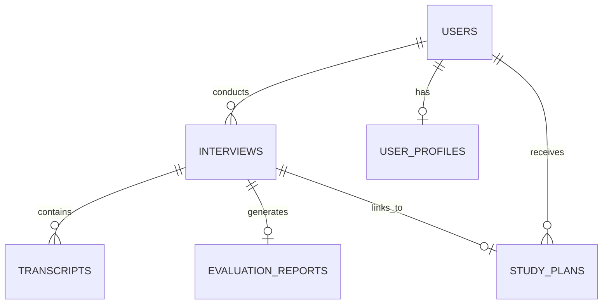

# Veriq AI - Database Schema Specification

This document details the database schemas and relationships for PostgreSQL (relational storage) and Qdrant (vector storage).

---

## 1. PostgreSQL Schema (SQLModel / SQLAlchemy)

We use PostgreSQL for all relational, session, transcript, and historical reporting data.



### Table 1: `users`
Stores user credentials and profile details.
* **Indexes**: Unique index on `email`.

| Column Name | Data Type | Constraints | Description |
| :--- | :--- | :--- | :--- |
| `id` | UUID | PRIMARY KEY, Default: uuid_generate_v4() | Unique identifier for the user. |
| `email` | VARCHAR(255) | UNIQUE, NOT NULL | User's email address. |
| `password_hash`| VARCHAR(255) | NOT NULL | Hashed password. |
| `full_name` | VARCHAR(100) | NOT NULL | User's name. |
| `created_at` | TIMESTAMP | DEFAULT CURRENT_TIMESTAMP | Timestamp when user registered. |
| `updated_at` | TIMESTAMP | DEFAULT CURRENT_TIMESTAMP | Timestamp when profile was updated. |

### Table 2: `interviews`
Tracks details of each mock interview session.
* **Indexes**: Foreign key index on `user_id`.

| Column Name | Data Type | Constraints | Description |
| :--- | :--- | :--- | :--- |
| `id` | UUID | PRIMARY KEY, Default: uuid_generate_v4() | Unique identifier for the interview. |
| `user_id` | UUID | FOREIGN KEY -> `users.id`, NOT NULL | Owner of the session. |
| `role` | VARCHAR(100) | NOT NULL | Target role (e.g., "AI Engineer"). |
| `difficulty` | VARCHAR(50) | NOT NULL | "easy", "medium", "hard". |
| `duration_minutes`| INT | NOT NULL | Intended length in minutes. |
| `mode` | VARCHAR(50) | NOT NULL | "quick", "company", "resume", "jd", "custom". |
| `company_name` | VARCHAR(100) | NULLABLE | Target company name. |
| `resume_text` | TEXT | NULLABLE | Parsed text from uploaded resume. |
| `jd_text` | TEXT | NULLABLE | Parsed text from uploaded Job Description. |
| `status` | VARCHAR(50) | NOT NULL, DEFAULT 'in_progress' | "in_progress", "completed", "failed". |
| `overall_score` | INT | NULLABLE | Populated after evaluation (0-100). |
| `readiness_score`| INT | NULLABLE | Readiness score calculated for this specific role. |
| `created_at` | TIMESTAMP | DEFAULT CURRENT_TIMESTAMP | Interview start time. |
| `ended_at` | TIMESTAMP | NULLABLE | Interview completion time. |

### Table 3: `transcripts`
Stores the individual utterances of an interview conversation.
* **Indexes**: Foreign key index on `interview_id`, chronological sorting index on `timestamp`.

| Column Name | Data Type | Constraints | Description |
| :--- | :--- | :--- | :--- |
| `id` | UUID | PRIMARY KEY, Default: uuid_generate_v4() | Unique utterance identifier. |
| `interview_id` | UUID | FOREIGN KEY -> `interviews.id`, ON DELETE CASCADE, NOT NULL | Associated interview session. |
| `sender` | VARCHAR(50) | NOT NULL | "interviewer" or "candidate". |
| `text` | TEXT | NOT NULL | The text content. |
| `audio_url` | VARCHAR(512) | NULLABLE | URL path to audio snippet (if voice mode enabled). |
| `topic` | VARCHAR(100) | NULLABLE | Topic tag inferred for this exchange. |
| `timestamp` | TIMESTAMP | DEFAULT CURRENT_TIMESTAMP | Epoch time of utterance. |

### Table 4: `evaluation_reports`
Detailed multi-dimensional breakdown generated by the Evaluation Agent.
* **Indexes**: Unique index on `interview_id`.

| Column Name | Data Type | Constraints | Description |
| :--- | :--- | :--- | :--- |
| `id` | UUID | PRIMARY KEY, Default: uuid_generate_v4() | Report ID. |
| `interview_id` | UUID | FOREIGN KEY -> `interviews.id`, UNIQUE, NOT NULL | Corresponding interview. |
| `overall_score` | INT | NOT NULL | Combined score out of 100. |
| `technical_score`| INT | NOT NULL | Technical knowledge score (0-100). |
| `communication_score`| INT | NOT NULL | Clarity and speech structure score (0-100). |
| `confidence_score`| INT | NOT NULL | Confidence and tone score (0-100). |
| `explanation_score`| INT | NOT NULL | Project explanation competence (0-100). |
| `problem_solving_score`| INT | NOT NULL | Analytical ability (0-100). |
| `behavioral_score`| INT | NOT NULL | Soft skills assessment (0-100). |
| `strengths` | JSONB | NOT NULL | Array of strings highlighting key strengths. |
| `weaknesses` | JSONB | NOT NULL | Array of strings highlighting key weaknesses. |
| `improvement_areas`| JSONB | NOT NULL | Actionable list of recommendations. |
| `generated_at` | TIMESTAMP | DEFAULT CURRENT_TIMESTAMP | Timestamp of report generation. |

### Table 5: `user_profiles`
Maintains long-term state data. Updated by the Memory Agent.
* **Indexes**: Unique index on `user_id`.

| Column Name | Data Type | Constraints | Description |
| :--- | :--- | :--- | :--- |
| `id` | UUID | PRIMARY KEY, Default: uuid_generate_v4() | Profile ID. |
| `user_id` | UUID | FOREIGN KEY -> `users.id`, UNIQUE, NOT NULL | Owner. |
| `weak_topics` | JSONB | NOT NULL, DEFAULT '[]' | Aggregated list of topics needing study. |
| `strong_topics` | JSONB | NOT NULL, DEFAULT '[]' | Aggregated list of mastered topics. |
| `target_readiness`| JSONB | NOT NULL, DEFAULT '{}' | Key-value mapping of roles and readiness (e.g., `{"Google SWE": 68}`). |
| `history_trends` | JSONB | NOT NULL, DEFAULT '[]' | History of interview scores across dates. |
| `last_updated` | TIMESTAMP | DEFAULT CURRENT_TIMESTAMP | Last profile calculations. |

### Table 6: `study_plans`
Contains study instructions, resources, and question links generated by the Planning Agent.
* **Indexes**: Foreign key index on `user_id`.

| Column Name | Data Type | Constraints | Description |
| :--- | :--- | :--- | :--- |
| `id` | UUID | PRIMARY KEY, Default: uuid_generate_v4() | Plan ID. |
| `user_id` | UUID | FOREIGN KEY -> `users.id`, NOT NULL | Student. |
| `associated_interview_id`| UUID | FOREIGN KEY -> `interviews.id`, NULLABLE | Original session generating this plan. |
| `roadmap` | JSONB | NOT NULL | Milestone-based study program. |
| `recommended_resources`| JSONB | NOT NULL | Links to materials matching weak topics. |
| `practice_questions`| JSONB | NOT NULL | Target exercises. |
| `created_at` | TIMESTAMP | DEFAULT CURRENT_TIMESTAMP | Creation time. |

---

## 2. Qdrant Vector DB Collections

We use Qdrant for semantic similarity searches against pre-compiled engineering learning materials.

### Collection: `global_knowledge_base`
* **Vector Configuration**:
  - Distance Metric: `Cosine`
  - Dimensions: `768` (Optimal for Gemini `text-embedding-004` model)

### Payload Structure
Every point in the collection contains the following payload schema:

```json
{
  "topic": "Transformers",
  "subtopic": "Self-Attention Mechanism",
  "difficulty": "Medium",
  "content": "Self-attention computes dynamic weights between token representations. It involves multiplying the input vectors with learned Query, Key, and Value matrices to output a weighted sum...",
  "resources": [
    {
      "title": "Illustrated Transformer",
      "url": "https://jalammar.github.io/illustrated-transformer/"
    }
  ],
  "practice_questions": [
    "What is the mathematical formulation of scaled dot-product attention?",
    "Why do we divide by the square root of the dimension of the key vector?"
  ]
}
```
* **Indexed Fields**: `topic`, `subtopic`, `difficulty` to allow strict metadata filtering prior to vector search calculations.
